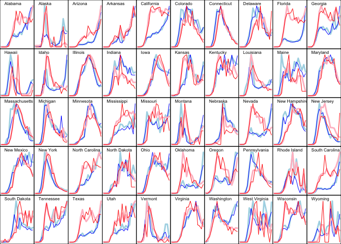

State-level C19 analyses
================
Peter Hoff
June 17, 2020

### Summary

This document illustrates the use of a hierarchical negative binomial
model to analyze time-series of US state-level C19 counts of deaths and
reported cases. This is done using essentially a bivariate fourth-order
autoregressive generalized linear model. For example, the death count
\(y^d_{j,t}\) in state \(t\) and week \(j\) is modeled as a function of
the (log) death counts and case counts in the previous four weeks: \[
 y^d_{j,t}  \sim   \beta_{j,0} + \beta_{j,1} \log y^d_{j,t-1} + \cdots +
       \beta_{j,4} \log y^d_{j,t-4}  + 
         \beta_{j,5} \log y^c_{j,t-1} + \cdots +
       \beta_{j,8} \log y^c_{j,t-4} .
\] A similar model is fit for the case data.

### Model fitting

Load in some data that has already been setup for AR model fitting:

``` r
lag<-4
load(paste0("C19AR",lag,".rdata")) 
```

Look at the data:

``` r
objects()
```

    ## [1] "lag" "W"   "X"   "yc"  "yd"

``` r
names(yd) 
```

    ##  [1] "Alabama"              "Alaska"               "Arizona"             
    ##  [4] "Arkansas"             "California"           "Colorado"            
    ##  [7] "Connecticut"          "Delaware"             "District of Columbia"
    ## [10] "Florida"              "Georgia"              "Hawaii"              
    ## [13] "Idaho"                "Illinois"             "Indiana"             
    ## [16] "Iowa"                 "Kansas"               "Kentucky"            
    ## [19] "Louisiana"            "Maine"                "Maryland"            
    ## [22] "Massachusetts"        "Michigan"             "Minnesota"           
    ## [25] "Mississippi"          "Missouri"             "Montana"             
    ## [28] "Nebraska"             "Nevada"               "New Hampshire"       
    ## [31] "New Jersey"           "New Mexico"           "New York"            
    ## [34] "North Carolina"       "North Dakota"         "Ohio"                
    ## [37] "Oklahoma"             "Oregon"               "Pennsylvania"        
    ## [40] "Rhode Island"         "South Carolina"       "South Dakota"        
    ## [43] "Tennessee"            "Texas"                "Utah"                
    ## [46] "Vermont"              "Virginia"             "Washington"          
    ## [49] "West Virginia"        "Wisconsin"            "Wyoming"

``` r
# deaths 
yd[[1]]
```

    ## 2020-02-23 2020-03-01 2020-03-08 2020-03-15 2020-03-22 2020-03-29 2020-04-05 
    ##          0          0          0          0          3         23         34 
    ## 2020-04-12 2020-04-19 2020-04-26 2020-05-03 2020-05-10 2020-05-17 2020-05-24 
    ##         50        102         75        101         94         69         67 
    ## 2020-05-31 2020-06-07 2020-06-14 2020-06-21 
    ##         66         84         70         80

``` r
# cases 
yc[[1]]
```

    ## 2020-02-23 2020-03-01 2020-03-08 2020-03-15 2020-03-22 2020-03-29 2020-04-05 
    ##          0          0         11        120        586        915       1630 
    ## 2020-04-12 2020-04-19 2020-04-26 2020-05-03 2020-05-10 2020-05-17 2020-05-24 
    ##       1457       1494       1398       2057       2003       2481       3206 
    ## 2020-05-31 2020-06-07 2020-06-14 2020-06-21 
    ##       2351       4511       5329       5528

``` r
# lagged logged deaths and cases as predictors 
X[[1]] 
```

    ##             dlag.m1  dlag.m2  dlag.m3  dlag.m4  clag.m1  clag.m2  clag.m3
    ## 2020-02-23 0.000000 0.000000 0.000000 0.000000 0.000000 0.000000 0.000000
    ## 2020-03-01 0.000000 0.000000 0.000000 0.000000 0.000000 0.000000 0.000000
    ## 2020-03-08 0.000000 0.000000 0.000000 0.000000 0.000000 0.000000 0.000000
    ## 2020-03-15 0.000000 0.000000 0.000000 0.000000 2.484907 0.000000 0.000000
    ## 2020-03-22 0.000000 0.000000 0.000000 0.000000 4.795791 2.484907 0.000000
    ## 2020-03-29 1.386294 0.000000 0.000000 0.000000 6.375025 4.795791 2.484907
    ## 2020-04-05 3.178054 1.386294 0.000000 0.000000 6.820016 6.375025 4.795791
    ## 2020-04-12 3.555348 3.178054 1.386294 0.000000 7.396949 6.820016 6.375025
    ## 2020-04-19 3.931826 3.555348 3.178054 1.386294 7.284821 7.396949 6.820016
    ## 2020-04-26 4.634729 3.931826 3.555348 3.178054 7.309881 7.284821 7.396949
    ## 2020-05-03 4.330733 4.634729 3.931826 3.555348 7.243513 7.309881 7.284821
    ## 2020-05-10 4.624973 4.330733 4.634729 3.931826 7.629490 7.243513 7.309881
    ## 2020-05-17 4.553877 4.624973 4.330733 4.634729 7.602900 7.629490 7.243513
    ## 2020-05-24 4.248495 4.553877 4.624973 4.330733 7.816820 7.602900 7.629490
    ## 2020-05-31 4.219508 4.248495 4.553877 4.624973 8.073091 7.816820 7.602900
    ## 2020-06-07 4.204693 4.219508 4.248495 4.553877 7.763021 8.073091 7.816820
    ## 2020-06-14 4.442651 4.204693 4.219508 4.248495 8.414496 7.763021 8.073091
    ## 2020-06-21 4.262680 4.442651 4.204693 4.219508 8.581107 8.414496 7.763021
    ##             clag.m4
    ## 2020-02-23 0.000000
    ## 2020-03-01 0.000000
    ## 2020-03-08 0.000000
    ## 2020-03-15 0.000000
    ## 2020-03-22 0.000000
    ## 2020-03-29 0.000000
    ## 2020-04-05 2.484907
    ## 2020-04-12 4.795791
    ## 2020-04-19 6.375025
    ## 2020-04-26 6.820016
    ## 2020-05-03 7.396949
    ## 2020-05-10 7.284821
    ## 2020-05-17 7.309881
    ## 2020-05-24 7.243513
    ## 2020-05-31 7.629490
    ## 2020-06-07 7.602900
    ## 2020-06-14 7.816820
    ## 2020-06-21 8.073091

``` r
# design matrix for random effects model
W[[1]]
```

    ##       [,1]    [,2] [,3] [,4] [,5] [,6] [,7] [,8] [,9] [,10]
    ##  [1,]    1 15.4054    0    0    0    0    0    0    0     0
    ##  [2,]    0  0.0000    1    0    0    0    0    0    0     0
    ##  [3,]    0  0.0000    0    1    0    0    0    0    0     0
    ##  [4,]    0  0.0000    0    0    1    0    0    0    0     0
    ##  [5,]    0  0.0000    0    0    0    1    0    0    0     0
    ##  [6,]    0  0.0000    0    0    0    0    1    0    0     0
    ##  [7,]    0  0.0000    0    0    0    0    0    1    0     0
    ##  [8,]    0  0.0000    0    0    0    0    0    0    1     0
    ##  [9,]    0  0.0000    0    0    0    0    0    0    0     1

The \(W_i\) matrix relates the first regression coefficient
\(\beta_{j,1}\) to the (log) population of state \(j\).

Now load functions for hierarchical negative binomial model fitting:

``` r
source("negbinHGLM.r") 
```

Fit the AR(4) model to both deaths and cases:

``` r
## -- fit AR model to deaths and to cases
fitDeaths<-negbinHGLM(yd,X,W)
fitCases<-negbinHGLM(yc,X,W) 

## -- save fits, as they take a long time to generate
save(fitDeaths,fitCases,file=paste0("C19AR",lag,"ModelFits.rdata"))
```

Now we will examine the fit. For both deaths and cases, we obtain fitted
values, specifically, posterior mean estimates of
\(\lambda_j \exp( \beta_{j}^\top x_{j,t} )\) for each state \(j\) and
each week \(t\), by averaging this quantity over the parameter values
simulated from the Markov chain.

``` r
## -- fitted values for deaths
Dobs<-Dfit<-NULL
for(i in 1:length(yd)){

   Bi<-fitDeaths$BPS[i,,]
   Li<-fitDeaths$LPS[,i]
   Xi<-cbind(1,X[[i]])
   Dfit<-rbind(Dfit,apply(sweep(exp(Xi%*%Bi),2,Li,"*"),1,mean))
   Dobs<-rbind(Dobs,yd[[i]] )
}

## -- fitted values for cases
Cobs<-Cfit<-NULL
for(i in 1:length(yc)){

   Bi<-fitCases$BPS[i,,]
   Li<-fitCases$LPS[,i]
   Xi<-cbind(1,X[[i]])
   Cfit<-rbind(Cfit,apply(sweep(exp(Xi%*%Bi),2,Li,"*"),1,mean))
   Cobs<-rbind(Cobs,yc[[i]] )
}
```

Now plot the observed and fitted values for each state.

  - observed deaths: thin red lines
  - fitted deaths: thick pink lines
  - observed cases: thin blue lines
  - fitted deaths: think light blue lines

<!-- end list -->

``` r
## -- plot fitted and observed
par(mfrow=c(5,10),mar=c(0,0,0,0),mgp=c(0,0,0))
for(i in (1:51)[-9]){ # Sorry DC
 plot(c(1,ncol(Dobs)),c(0,1.1),type="n",xlab="",ylab="",xaxt="n",yaxt="n")

 yo<-Cobs[i,] ; yf<-Cfit[i,] ; mx<-max(c(yo,yf)) 
 yo<-yo/mx ; yf<-yf/mx  
 lines(yf,col="lightblue",lwd=3)
 lines(yo,col="blue") 

 yo<-Dobs[i,] ; yf<-Dfit[i,] ; mx<-max(c(yo,yf)) 
 yo<-yo/mx ; yf<-yf/mx 
 lines(yf,col="pink",lwd=3)
 lines(yo,col="red")  
 text(1,max(c(yo,yf))*1.05,names(X)[i],pos=4,cex=.8 ) 
}
```

<!-- -->
