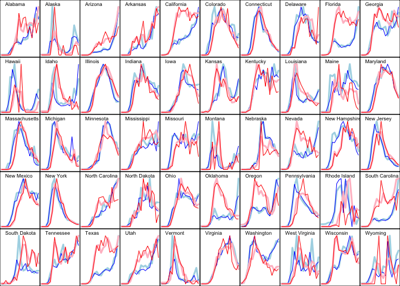

State-level C19 analyses
================
Peter Hoff
June 17, 2020


### Summary

This document illustrates the use of a hierarchical negative binomial
model to analyze time-series of US state-level C19 counts of deaths and
reported cases. This is done using essentially a bivariate fourth-order
autoregressive generalized linear model. For example, the death count
\(y^d_{j,t}\) in state \(t\) and week \(j\) is modeled as a function of
the (log) death counts and case counts in the previous four weeks: \[
 y^d_{j,t}  \sim   \beta_{j,0} + \beta_{j,1} \log y^d_{j,t-1} + \cdots +
       \beta_{j,4} \log y^d_{j,t-4}  + 
         \beta_{j,5} \log y^c_{j,t-1} + \cdots +
       \beta_{j,8} \log y^c_{j,t-4} .
\] A similar model is fit for the case data.

Load in some data that has already been setup for AR model fitting:

``` r
lag<-4
load(paste0("C19AR",lag,".rdata")) 
```

Look at the data:

``` r
objects()
```

    ## [1] "lag" "W"   "X"   "yc"  "yd"

``` r
names(yd) 
```

    ##  [1] "Alabama"              "Alaska"               "Arizona"             
    ##  [4] "Arkansas"             "California"           "Colorado"            
    ##  [7] "Connecticut"          "Delaware"             "District of Columbia"
    ## [10] "Florida"              "Georgia"              "Hawaii"              
    ## [13] "Idaho"                "Illinois"             "Indiana"             
    ## [16] "Iowa"                 "Kansas"               "Kentucky"            
    ## [19] "Louisiana"            "Maine"                "Maryland"            
    ## [22] "Massachusetts"        "Michigan"             "Minnesota"           
    ## [25] "Mississippi"          "Missouri"             "Montana"             
    ## [28] "Nebraska"             "Nevada"               "New Hampshire"       
    ## [31] "New Jersey"           "New Mexico"           "New York"            
    ## [34] "North Carolina"       "North Dakota"         "Ohio"                
    ## [37] "Oklahoma"             "Oregon"               "Pennsylvania"        
    ## [40] "Rhode Island"         "South Carolina"       "South Dakota"        
    ## [43] "Tennessee"            "Texas"                "Utah"                
    ## [46] "Vermont"              "Virginia"             "Washington"          
    ## [49] "West Virginia"        "Wisconsin"            "Wyoming"

``` r
# deaths 
yd[[1]]
```

    ## 2.28.2020  3.6.2020 3.13.2020 3.20.2020 3.27.2020  4.3.2020 4.10.2020 4.17.2020 
    ##         0         0         0         0         1        16        31        34 
    ## 4.24.2020  5.1.2020  5.8.2020 5.15.2020 5.22.2020 5.29.2020  6.5.2020 6.12.2020 
    ##       112        75        99       102        59        76        46        99 
    ## 6.19.2020 6.26.2020 
    ##        59        87

``` r
# cases 
yc[[1]]
```

    ## 2.28.2020  3.6.2020 3.13.2020 3.20.2020 3.27.2020  4.3.2020 4.10.2020 4.17.2020 
    ##         0         0         5       101       533       895      1473      1508 
    ## 4.24.2020  5.1.2020  5.8.2020 5.15.2020 5.22.2020 5.29.2020  6.5.2020 6.12.2020 
    ##      1511      1268      2090      2003      2283      3361      2042      4260 
    ## 6.19.2020 6.26.2020 
    ##      5669      4204

``` r
# lagged logged deaths and cases as predictors 
X[[1]] 
```

    ##             dlag.m1   dlag.m2   dlag.m3   dlag.m4  clag.m1  clag.m2  clag.m3
    ## 2.28.2020 0.0000000 0.0000000 0.0000000 0.0000000 0.000000 0.000000 0.000000
    ## 3.6.2020  0.0000000 0.0000000 0.0000000 0.0000000 0.000000 0.000000 0.000000
    ## 3.13.2020 0.0000000 0.0000000 0.0000000 0.0000000 0.000000 0.000000 0.000000
    ## 3.20.2020 0.0000000 0.0000000 0.0000000 0.0000000 1.791759 0.000000 0.000000
    ## 3.27.2020 0.0000000 0.0000000 0.0000000 0.0000000 4.624973 1.791759 0.000000
    ## 4.3.2020  0.6931472 0.0000000 0.0000000 0.0000000 6.280396 4.624973 1.791759
    ## 4.10.2020 2.8332133 0.6931472 0.0000000 0.0000000 6.797940 6.280396 4.624973
    ## 4.17.2020 3.4657359 2.8332133 0.6931472 0.0000000 7.295735 6.797940 6.280396
    ## 4.24.2020 3.5553481 3.4657359 2.8332133 0.6931472 7.319202 7.295735 6.797940
    ## 5.1.2020  4.7273878 3.5553481 3.4657359 2.8332133 7.321189 7.319202 7.295735
    ## 5.8.2020  4.3307333 4.7273878 3.5553481 3.4657359 7.145984 7.321189 7.319202
    ## 5.15.2020 4.6051702 4.3307333 4.7273878 3.5553481 7.645398 7.145984 7.321189
    ## 5.22.2020 4.6347290 4.6051702 4.3307333 4.7273878 7.602900 7.645398 7.145984
    ## 5.29.2020 4.0943446 4.6347290 4.6051702 4.3307333 7.733684 7.602900 7.645398
    ## 6.5.2020  4.3438054 4.0943446 4.6347290 4.6051702 8.120291 7.733684 7.602900
    ## 6.12.2020 3.8501476 4.3438054 4.0943446 4.6347290 7.622175 8.120291 7.733684
    ## 6.19.2020 4.6051702 3.8501476 4.3438054 4.0943446 8.357259 7.622175 8.120291
    ## 6.26.2020 4.0943446 4.6051702 3.8501476 4.3438054 8.642944 8.357259 7.622175
    ##            clag.m4
    ## 2.28.2020 0.000000
    ## 3.6.2020  0.000000
    ## 3.13.2020 0.000000
    ## 3.20.2020 0.000000
    ## 3.27.2020 0.000000
    ## 4.3.2020  0.000000
    ## 4.10.2020 1.791759
    ## 4.17.2020 4.624973
    ## 4.24.2020 6.280396
    ## 5.1.2020  6.797940
    ## 5.8.2020  7.295735
    ## 5.15.2020 7.319202
    ## 5.22.2020 7.321189
    ## 5.29.2020 7.145984
    ## 6.5.2020  7.645398
    ## 6.12.2020 7.602900
    ## 6.19.2020 7.733684
    ## 6.26.2020 8.120291

``` r
# design matrix for random effects model
W[[1]]
```

    ##       [,1]    [,2] [,3] [,4] [,5] [,6] [,7] [,8] [,9] [,10]
    ##  [1,]    1 15.4054    0    0    0    0    0    0    0     0
    ##  [2,]    0  0.0000    1    0    0    0    0    0    0     0
    ##  [3,]    0  0.0000    0    1    0    0    0    0    0     0
    ##  [4,]    0  0.0000    0    0    1    0    0    0    0     0
    ##  [5,]    0  0.0000    0    0    0    1    0    0    0     0
    ##  [6,]    0  0.0000    0    0    0    0    1    0    0     0
    ##  [7,]    0  0.0000    0    0    0    0    0    1    0     0
    ##  [8,]    0  0.0000    0    0    0    0    0    0    1     0
    ##  [9,]    0  0.0000    0    0    0    0    0    0    0     1

The \(W_i\) matrix relates the first regression coefficient
\(\beta_{j,1}\) to the (log) population of state \(j\).

Now load functions for hierarchical negative binomial model fitting.

``` r
source("negbinHGLM.r") 
```

Fit the AR(4) model to both deaths and cases:

``` r
## -- fit AR model to deaths and to cases
fitDeaths<-negbinHGLM(yd,X,W)
fitCases<-negbinHGLM(yc,X,W) 

## -- save fits, as they take a long time to generate
save(fitDeaths,fitCases,file=paste0("C19AR",lag,"ModelFits.rdata"))
```

Now we will examine the fit. For both deaths and cases, we obtain
posterior mean estimates of \(\lambda_j \exp( \beta_{j}^\top x_{j,t} )\)
for each state \(j\) and each week \(t\), by averaging this quantity
over the parameter values simulated from the Markov chain.

``` r
## -- fitted values for deaths
Dobs<-Dfit<-NULL
for(i in 1:length(yd)){

   Bi<-fitDeaths$BPS[i,,]
   Li<-fitDeaths$LPS[,i]
   Xi<-cbind(1,X[[i]])
   Dfit<-rbind(Dfit,apply(sweep(exp(Xi%*%Bi),2,Li,"*"),1,mean))
   Dobs<-rbind(Dobs,yd[[i]] )
}

## -- fitted values for cases
Cobs<-Cfit<-NULL
for(i in 1:length(yc)){

   Bi<-fitCases$BPS[i,,]
   Li<-fitCases$LPS[,i]
   Xi<-cbind(1,X[[i]])
   Cfit<-rbind(Cfit,apply(sweep(exp(Xi%*%Bi),2,Li,"*"),1,mean))
   Cobs<-rbind(Cobs,yc[[i]] )
}
```

Now plot the observed and fitted for each state.

  - observed deaths: thin red lines
  - fitted deaths: thick pink lines
  - observed cases: thin blue lines
  - fitted deaths: think light blue lines

<!-- end list -->

``` r
## -- plot fitted and observed
par(mfrow=c(5,10),mar=c(0,0,0,0),mgp=c(0,0,0))
for(i in (1:51)[-9]){ # Sorry DC
 plot(c(1,ncol(Dobs)),c(0,1.1),type="n",xlab="",ylab="",xaxt="n",yaxt="n")

 yo<-Cobs[i,] ; yf<-Cfit[i,] ; mx<-max(c(yo,yf)) 
 yo<-yo/mx ; yf<-yf/mx  
 lines(yf,col="lightblue",lwd=3)
 lines(yo,col="blue") 

 yo<-Dobs[i,] ; yf<-Dfit[i,] ; mx<-max(c(yo,yf)) 
 yo<-yo/mx ; yf<-yf/mx 
 lines(yf,col="pink",lwd=3)
 lines(yo,col="red")  
 text(1,max(c(yo,yf))*1.05,names(X)[i],pos=4,cex=.8 ) 
}
```

<!-- -->
